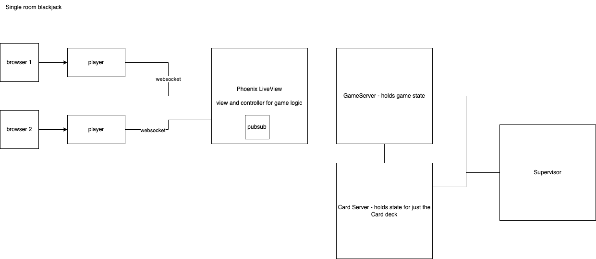
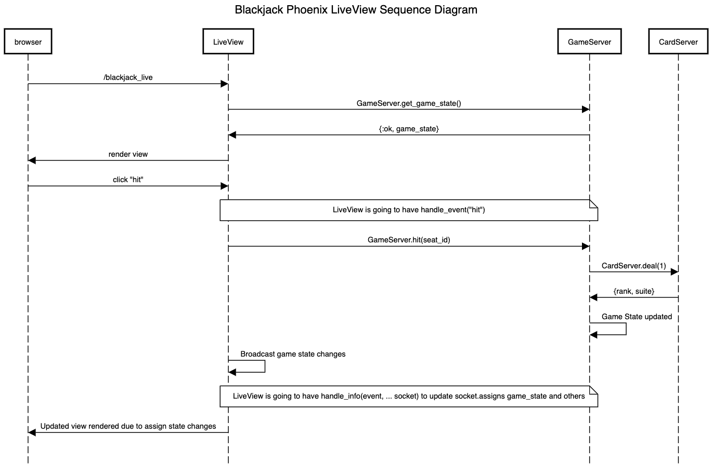

# Multiplayer Blackjack

## Start Guide

To start your Phoenix server:

  * Install dependencies with `mix deps.get`
  * Start Phoenix endpoint with `mix phx.server` or inside IEx with `iex -S mix phx.server`

Now you can visit [`localhost:4000/`](http://localhost:4000) from your browser, and since it's a Phoenix liveview application, you can open up another browser to play the blackjack game.

`localhost:4000` is the lobby where you need to enter your name to enter into the blackjack room. Once you've entered your name, you will be redirected to `localhost:4000/blackjack_live`

## Introduction

This is a simplified version of Multiplayer Blackjack game with the following features implemented:

* Multiplayer ability
* Single Room
* Can only seat up to 3 players
* Any players that have taken a seat can click "start game" to start each game (This is different from traditional blackjack where we are not using any betting)
* Players can choose to leave seat before a game round starts or after the game round ends
* The Game round starts as soon as any seated player click Start Game
* Players and Dealer total rounds won is tracked and displayed in their respective areas

## Architecture



## Sequence Diagram
* Here's a simple sequence diagram that demonstrates the Hit action so we can see how each component interacts with each other. 
* Ideally, as you can see in the diagram, once GameServer has updated the game state, it should send back a response with the new game state before the changes are broadcasted, but we've chosen to handle the update asynchronously for now and will update this in the future. Or have the GameServer broadcast the update instead. Either way is probably a better design thatn what we have right now. 



**Note:** The sequence diagram is generated using this tool - sequencediagram.org, and the txt file is stored in `./resources`

## Frontend Design

* This simple design gives us an idea of the flow of the game
* Go here for the design 
  * `./priv/static/design/simple_multiplayer_blackjack_design.pdf`

## Data Structures for tracking Game_State, Card, and Player

* We have decided to have a Game Server and Card Server take care of the Game State and the Card Deck state to achieve modularity.

Here's the game_state structure that will be used to track the changes in the game

Game_State

```

{
  dealer: array of Card 
  total_players: array of player_id
  game_in_progress: boolean
  completed_games: integer 
  turn: integer
  seat1: nil | Player
  seat2: nil | Player
  seat3: nil | Player
  dealer_score: integer
}

```

Card:

```
{rank, suite}

```

Player

```

{
  playerID: string
  hand: array of Card
  hand_value: integer
  hand_options: map that has low and high hand value (because of Ace)
  result: nil | :bust | :win | :draw | :lose
  score: integer
}

```

## Future Release

* This game is only an MVP as we were using it to learn more about Phoenix Liveview, in order to make this game more robust, the following features could be included in the next release to make it more like a real blackjack game:

1. Add betting starting balance
2. Remove start game and instead game to be started when all players have placed their bet
3. Add Timer for when players can place their bet
4. Add Timer for when player needs to make hit or stand decisions
5. Add Split to enable players to hold more than 1 hand
6. Add hand total for Dealer

## Learn more About Phoenix

  * Official website: https://www.phoenixframework.org/
  * Guides: https://hexdocs.pm/phoenix/overview.html
  * Docs: https://hexdocs.pm/phoenix
  * Forum: https://elixirforum.com/c/phoenix-forum
  * Source: https://github.com/phoenixframework/phoenix


